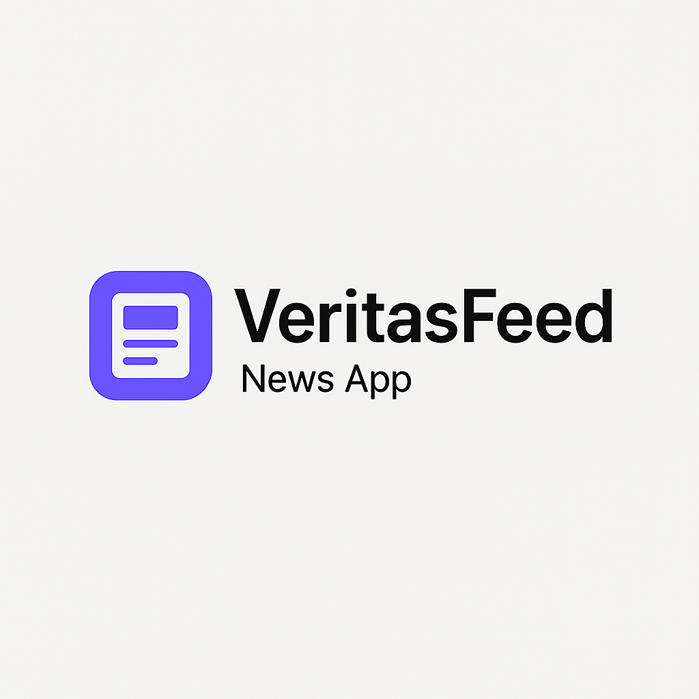
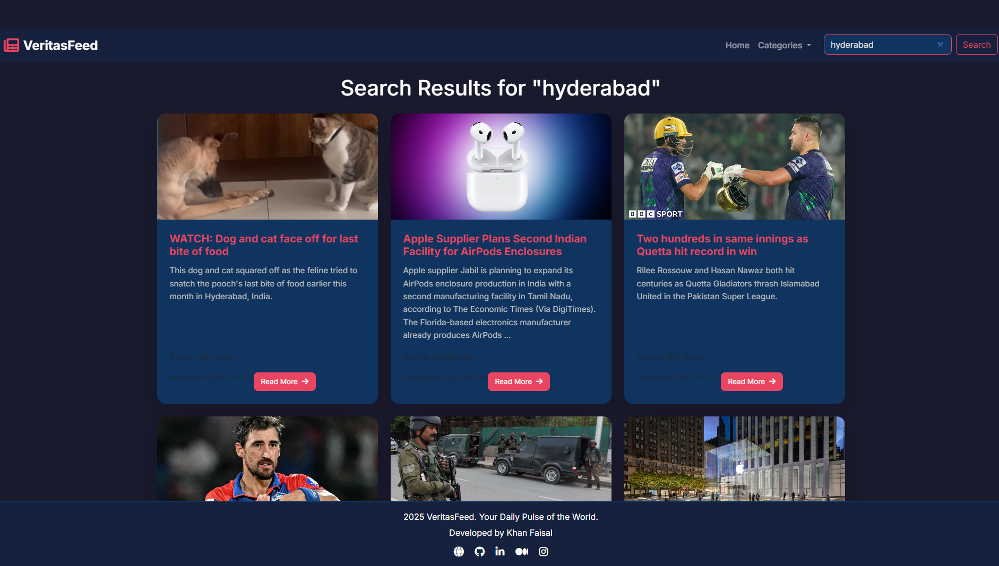

# 📰 VeritasFeed — Your Daily Pulse of the World



**VeritasFeed** is a dynamic and real-time news web application built with **Flask** and styled using a modern dark-themed interface. With category browsing, keyword search, and real-time headlines from around the world, it provides a seamless way to stay informed — all in a responsive, animated, and visually engaging layout.

---

## 🌐 Live Demo

👉 [**View Live Project**](https://veritas-feed.vercel.app/)

---

## 🔥 Features

- 🗞️ **Live News Updates**: Real-time headlines and articles using NewsAPI.
- 🧭 **Category Browsing**: Browse news by Business, Health, Science, Tech, Sports, etc.
- 🔍 **Keyword Search**: Search any topic instantly with full-text lookup.
- 🌙 **Dark Theme UI**: Elegant design using Bootstrap 5 and custom CSS.
- 📱 **Responsive Design**: Optimized for desktop, tablet, and mobile.
- ⚡ **Fixed Footer**: Persistent footer with developer contact links.
- ❌ **Custom 404 Page**: Clean fallback interface for invalid routes.

---

## 📸 Project Screenshots

| Homepage | Search |
|----------|----------------|
|  |  |

---

## 🧠 How it Works

- News content is fetched from the [NewsAPI](https://newsapi.org).
- Categories are handled via routes and query strings.
- All content is dynamically injected using Flask and rendered with Jinja templates.
- Custom error handling for failed requests and 404 routes.

---

## 🛠️ Tech Stack

- **Backend**: Flask (Python 3.13.2), Requests
- **Frontend**: HTML5, CSS3, JavaScript, Bootstrap 5
- **API**: [NewsAPI.org](https://newsapi.org)
- **Assets**: Font Awesome, Custom Dark Theme

---

## 🔑 API Setup

1. Sign up at [NewsAPI.org](https://newsapi.org).
2. Get your API key from your dashboard.
3. Export the key as an environment variable:

**Linux/macOS:**
```bash
export NEWS_API_KEY="your_api_key"
```

**Windows (CMD):**
```cmd
set NEWS_API_KEY=your_api_key
```

**PowerShell:**
```powershell
$env:NEWS_API_KEY="your_api_key"
```

---

## 📁 Project Structure

```
veritasfeed/
├── app.py
├── requirements.txt
├── vercel.json
├── templates/
│   ├── base.html
│   ├── index.html
│   ├── category.html
│   ├── search.html
│   └── error.html
├── static/
│   ├── css/
│   │   └── style.css
│   ├── js/
│   │   └── script.js
│   └── images/
│       ├── placeholder_news.jpg
│       ├── placeholder_tech.jpg
│       └── placeholder_sports.jpg
└── assets/
    ├── cover_image.png
    ├── screenshot_1.png
    └── screenshot_2.png
```

---

## 🚀 Getting Started

```bash
git clone https://github.com/VertiasFeed.git
cd VeritasFeed
python3 -m venv venv
source venv/bin/activate  # or .\venv\Scripts\activate on Windows
pip install -r requirements.txt
flask run
```

Then open [http://127.0.0.1:5000](http://127.0.0.1:5000) in your browser.

---

## 🙋‍♂️ Developer

**Khan Faisal**

- 🌐 [Portfolio](https://khanfaisal.netlify.app)
- 💻 [GitHub](https://github.com/khanfaisal79960)
- 🔗 [LinkedIn](https://www.linkedin.com/in/khanfaisal79960)
- ✍️ [Medium](https://medium.com/@khanfaisal79960)
- 📷 [Instagram](https://instagram.com/mr._perfect_1004)

---